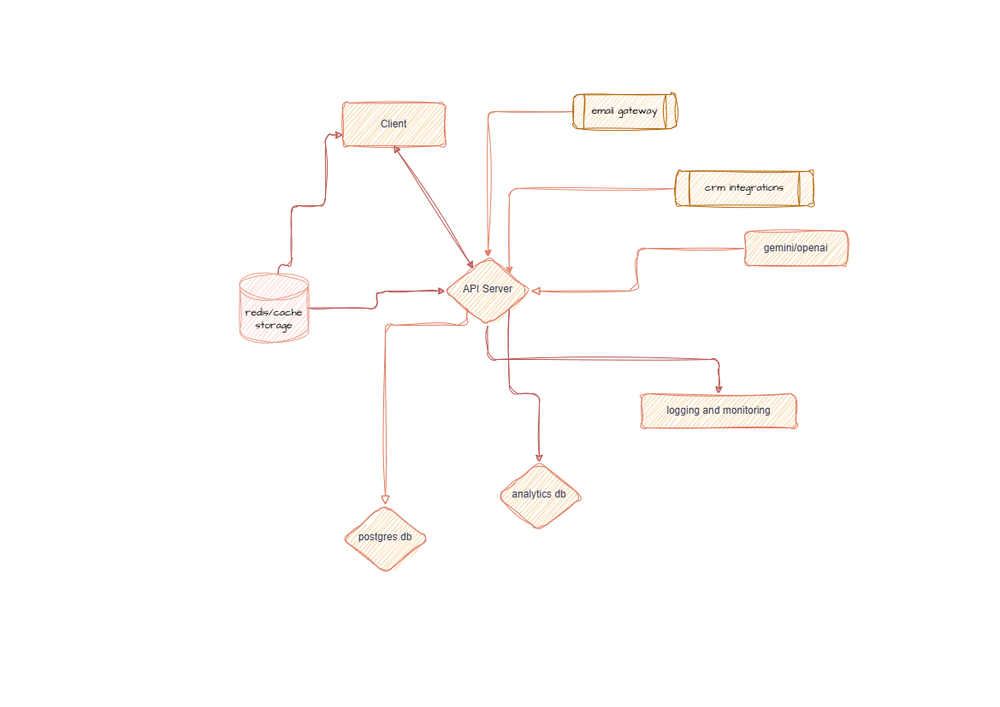

# Cerebro

Intelligent email platform for bulk emails, newsletters, and marketing campaigns.

## Structure

- `/services\`: Go microservices
- `/web\`: Next.js web applications
- `/infra\`: Infrastructure configuration
- `/api\`: API definitions
- `/internal\`: Shared Go packages
- `/docs\`: Documentation

## Development

### Prerequisites

- Go 1.21+
- Node.js 18+
- pnpm 8+
- Docker and Docker Compose
